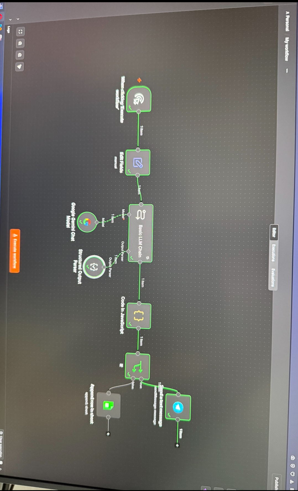
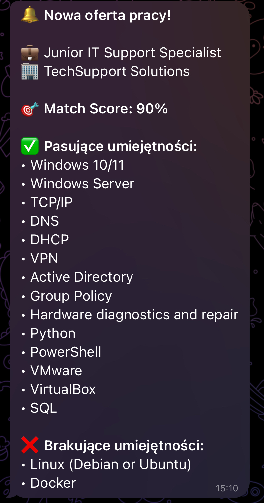
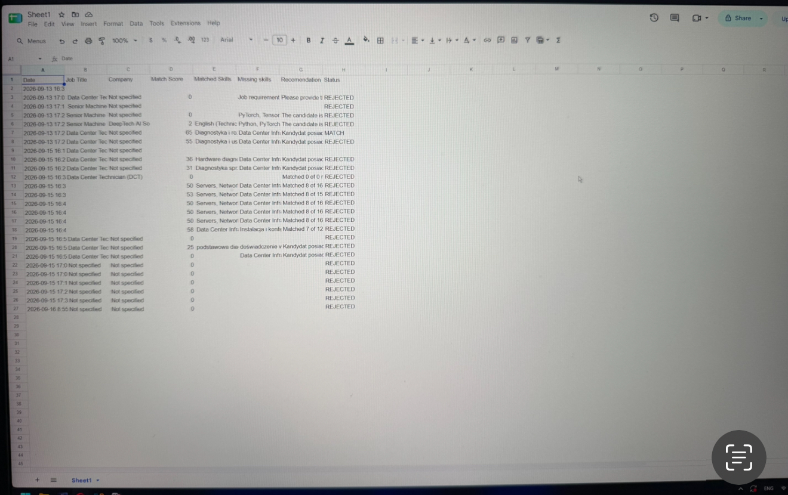

# AI Job Matcher

An n8n workflow that scores job offers against my CV using Google Gemini, and notifies me on Telegram when there's a good match.

I built this while job-hunting in Poland — reading 50+ offers per week was killing my time.

---

## How it works

1. Paste a job description into the workflow
2. Gemini extracts the actual technical skills the job requires
3. A JavaScript Code node compares them against my CV
4. Score is calculated (0–100%)
5. If score >= 65% → Telegram notification
6. If not → logged in Google Sheets

---

## Stack

`n8n` · `Google Gemini 2.5 Flash` · `JavaScript` · `Telegram Bot API` · `Google Sheets`

---

## Architecture

    [Manual Trigger] → [Edit Fields] → [LLM Chain] ← Gemini
                                            ↓
                                    [Output Parser]
                                            ↓
                                    [Code: scoring]
                                            ↓
                                        [IF: >= 65%]
                                       /          \
                                  Telegram      Sheets

---

## Setup

### 1. Import
Download `workflow/job-matcher.json` → import into n8n.

### 2. Configure credentials
You need three credentials:

| Service | Where to get it |
|---|---|
| **Gemini API key** | [aistudio.google.com](https://aistudio.google.com/app/apikey) |
| **Google Sheets OAuth2** | [Google Cloud Console](https://console.cloud.google.com) → enable Sheets API → create OAuth client |
| **Telegram Bot** | [@BotFather](https://t.me/BotFather) → `/newbot` → copy token |

### 3. Update these fields in the workflow

| Node | Field | What to enter |
|---|---|---|
| Google Gemini Chat Model | Credential | Your Gemini API key |
| Send a text message | Credential | Your Telegram bot token |
| Send a text message | Chat ID | Your Telegram Chat ID |
| Append row in sheet | Credential | Your Google Sheets OAuth2 |
| Append row in sheet | Document ID | Your Google Sheet ID |
| Basic LLM Chain | Prompt | Your CV text |

### 4. Google Sheet structure

| Date | Job Title | Company | Match Score | Matched Skills | Missing skills | Recommendation | Status |
|---|---|---|---|---|---|---|---|

---

## Why a Code node for scoring?

First version had Gemini calculating the score. Same input gave 45% one run, 70% the next. So I split it:

- **AI** extracts skills (language task)
- **JavaScript** compares and scores (logic task)

Score is now consistent. This is the same pattern used in production AI systems.

---

## What I learned

- LLMs are unreliable for math. Never let them calculate numbers.
- `temperature=0` reduces variance but doesn't eliminate it. Gemini still varies ±5%.
- JSON Schema mode in the Output Parser can backfire — the model returns the schema structure instead of data. Use "JSON Example" mode.
- Always enable **retry on AI nodes** — Gemini free tier throws 503 errors.
- **Sanitize workflow JSON** before publishing — remove Chat IDs, sheet IDs, credential IDs.

---

## Limitations

- Score varies ±5% across runs (LLM limit, not fixable)
- CV is hardcoded in the prompt
- No deduplication yet
- English/Polish job descriptions only

---

## TODO

- [ ] Move CV to a separate node
- [ ] Add deduplication
- [ ] Add Claude as fallback when Gemini fails
- [ ] Parse jobs from URLs

---

## Screenshots

---

## License

MIT — fork, adapt, use for your own job search.